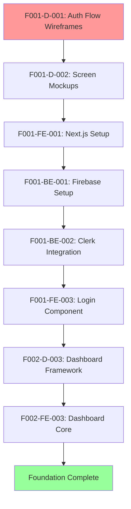
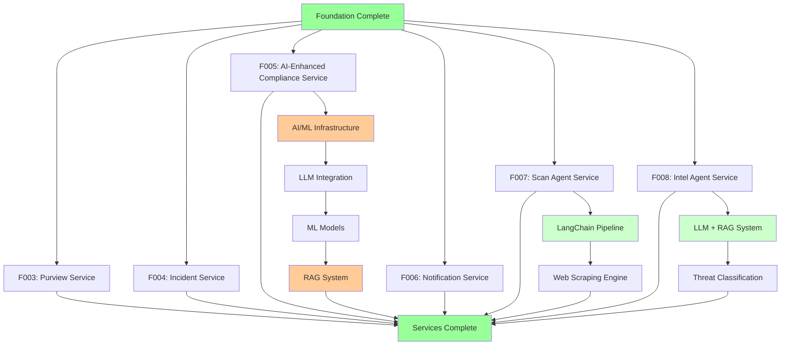
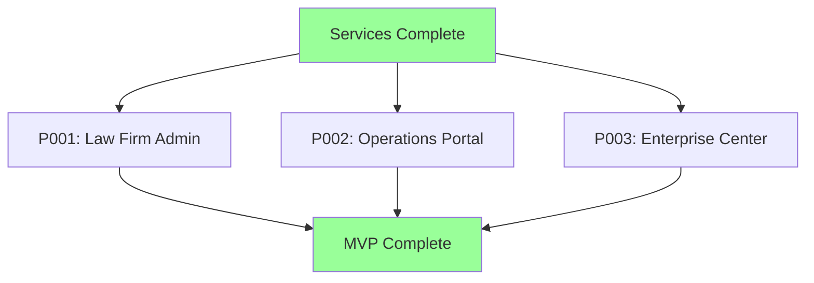

# Atraiva Platform - Task Dependencies & Project Planning

## Overview
This document provides a comprehensive view of task dependencies, critical paths, and project planning information for the Atraiva Breach Notification Platform. It serves as a guide for project managers, team leads, and stakeholders to understand the sequential and parallel development opportunities.

## Critical Path Analysis

### Phase 1: Foundation (Weeks 1-4) - CRITICAL PATH
**No Parallel Work Possible - Everything Depends on This**

**Foundation Blockers**:
- F001 must be 100% complete before any other features can start
- F002 dashboard framework must be functional before persona modules
- All authentication and multi-tenancy must be working

### Phase 2: Services Development (Weeks 5-12) - PARALLEL POSSIBLE

**Service Dependencies**:
- **F010 (Infrastructure)** - Must complete before any service development (Foundation Phase)
- F003 (Purview) - Can start immediately after Foundation
- F004 (Incident) - Can start immediately after Foundation  
- F005 (AI-Enhanced Compliance) - Can start immediately after Foundation, extends to week 12
- F006 (Notification) - Can start immediately after Foundation
- **F007 (Scan Agent)** - Can start immediately after Foundation, Python microservice
- **F008 (Intel Agent)** - Can start immediately after Foundation, AI-powered service
- **F009 (Dry Run Simulation)** - Can start after F005 compliance engine foundation
- All services can develop in parallel (except F009 dependency on F005)
- **NEW**: F005 AI components have internal dependencies (Infrastructure → LLM → ML Models → RAG)
- **NEW**: F007 has internal dependencies (LangChain → Web Scraping → Data Processing)
- **NEW**: F008 has internal dependencies (LLM+RAG → Threat Classification → Alerting)
- **NEW**: F009 depends on F005 AI components for playbook generation

### Phase 3-5: Persona Modules (Weeks 11-16) - PARALLEL POSSIBLE

**Persona Module Dependencies**:
- All require F002 Dashboard Framework to be complete
- All require relevant service APIs to be functional
- Can develop in parallel once dependencies met

## Detailed Dependency Matrix

### Foundation Layer (F001, F002)

| Task | Blocks | Blocked By | Can Parallel With |
|------|--------|------------|-------------------|
| F001-D-001 | All F001 design | - | Database schema design |
| F001-FE-001 | All F001 frontend | - | Backend planning |
| F001-BE-001 | All F001 backend | - | Design work |
| F002-D-003 | All dashboard work | F001 complete | Service API design |
| F002-FE-003 | Persona modules | F001-FE complete | Service development |

### Service Layer (F003-F006)

| Service | Hard Dependencies | Soft Dependencies | Parallel Opportunities |
|---------|-------------------|-------------------|------------------------|
| F003 Purview | F001, F002 APIs | Database schema | F004, F005, F006 |
| F004 Incidents | F001, F002 APIs | F003 (PII detection) | F003, F005, F006 |
| F005 AI-Enhanced Compliance | F001, F002 APIs, AI/ML Infrastructure | Database regulations, LLM APIs | F003, F004, F006 |
| F006 Notifications | F001, F002 APIs | F004 (incident triggers) | F003, F004, F005 |

### AI/ML Dependencies (F005 Internal)

| Component | Hard Dependencies | Soft Dependencies | Duration |
|-----------|-------------------|-------------------|----------|
| AI Infrastructure Setup | F005-BE-001 | Python 3.11+, Docker | Sprint 9 |
| LLM Integration | AI Infrastructure | OpenAI/Anthropic APIs | Sprint 9-10 |
| ML Prediction Models | LLM Integration | Training datasets | Sprint 10-11 |
| RAG System | ML Models | Vector DB (Pinecone/Weaviate) | Sprint 11-12 |

### Persona Layer (P001-P005)

| Persona Module | Required Services | Dashboard Dependency | Parallel Opportunities |
|----------------|-------------------|---------------------|------------------------|
| P001 Admin | F002, F003, F004, F005, F006 | F002 complete | P002, P003 |
| P002 Operations | F002, F003, F004, F005, F006 | F002 complete | P001, P003 |
| P003 Enterprise | F002, F004, F005 | F002 complete | P001, P002 |
| P004 Partners | F002, F005 | F002 complete | P005 |
| P005 Platform Admin | F002, All services | F002 complete | P004 |

## Resource Allocation & Team Assignment

### Phase 1: Foundation (4 weeks)
**Team Size**: 8-10 people (full focus required)

| Week | Frontend Team (3) | Backend Team (3) | Design Team (2) | QA Team (2) |
|------|------------------|------------------|-----------------|-------------|
| 1 | Setup & planning | Firebase setup | Auth flow design | Test planning |
| 2 | Auth components | Clerk integration | Dashboard design | Unit test setup |
| 3 | Dashboard core | RBAC system | Review & iterate | Integration tests |
| 4 | Polish & testing | Security hardening | Final approval | E2E testing |

### Phase 2: Services (8 weeks)
**Team Size**: 15-18 people (can split into service teams)

| Service Team | Frontend (2) | Backend (2) | AI/ML (1) | QA (1) | Weeks |
|--------------|--------------|-------------|-----------|--------|--------|
| Purview Team | F003-FE tasks | F003-BE tasks | - | F003 testing | 6 weeks |
| Incident Team | F004-FE tasks | F004-BE tasks | - | F004 testing | 6 weeks |
| **AI-Enhanced Compliance Team** | F005-FE tasks | F005-BE tasks | **F005-AI tasks** | F005 testing | **8 weeks** |
| Notification Team | F006-FE tasks | F006-BE tasks | - | F006 testing | 6 weeks |

### Phase 3-5: Persona Modules (6 weeks)
**Team Size**: 12-15 people (can parallelize persona development)

| Persona Team | Frontend (2) | Backend (1) | QA (1) | Priority |
|--------------|--------------|-------------|--------|----------|
| P001 Admin | P001-FE tasks | P001-BE tasks | P001 testing | P0 |
| P002 Operations | P002-FE tasks | P002-BE tasks | P002 testing | P0 |
| P003 Enterprise | P003-FE tasks | P003-BE tasks | P003 testing | P0 |
| P004 Partners | P004-FE tasks | P004-BE tasks | P004 testing | P1 |
| P005 Platform Admin | P005-FE tasks | P005-BE tasks | P005 testing | P1 |

## Sprint Planning Guide

### Sprint Structure (2-week sprints)

#### Sprints 1-2: Foundation Setup
**Sprint 1**: Authentication & Core Setup
- F001 design tasks
- Project setup and tooling
- Basic authentication implementation
- Initial Firebase configuration

**Sprint 2**: Dashboard Framework Foundation
- Complete F001 authentication
- Begin F002 dashboard framework
- RBAC system foundation
- Initial dashboard components

#### Sprints 3-4: Foundation Completion
**Sprint 3**: Dashboard Framework Core
- Complete F002 dashboard framework
- User management system
- Widget registration system
- Role-based menu generation

**Sprint 4**: Foundation Hardening
- Security testing and hardening
- Performance optimization
- Complete test coverage
- Production readiness

#### Sprints 5-12: Services Development
**Sprint 5-6**: Service Foundation
- F003 Purview integration setup
- F004 Incident management core
- F005 Compliance engine foundation
- F006 Notification service setup

**Sprint 7-8**: Core Service Implementation
- Complete core service functionality
- API endpoint implementation
- Service-to-service integration
- Business logic implementation

**Sprint 9-10**: AI/ML Foundation
- F005 AI infrastructure setup
- LLM integration and testing
- ML model development
- RAG system implementation

**Sprint 11-12**: AI/ML Integration & Service Completion
- AI component integration
- Advanced ML features
- Service testing and hardening
- Performance optimization
- Security testing
- Documentation completion

#### Sprints 13-18: Persona Modules (Adjusted for AI Development)
**Sprint 13-14**: Primary Personas
- P001 Law Firm Admin portal
- Begin P002 Operations portal
- Dashboard module registration
- Core functionality implementation
- Integration with AI-enhanced F005

**Sprint 15-16**: Operations & Enterprise
- Complete P002 Operations portal
- P003 Enterprise command center
- Advanced features implementation
- Integration testing with AI components

**Sprint 17-18**: MVP Completion
- Final integration testing
- AI performance validation
- User acceptance testing
- Production deployment preparation

## Risk Management & Mitigation

### High-Risk Dependencies

#### Foundation Delays (Critical Risk)
**Impact**: Delays entire project timeline
**Mitigation Strategies**:
- Over-allocate resources to foundation phase
- Daily standups with foundation teams
- Weekly stakeholder reviews
- Pre-planned contingency resources

#### Third-Party Integration Failures
**Risk Areas**: Clerk Auth, Microsoft Purview, Email Services, **AI/ML APIs**
**Mitigation Strategies**:
- Early integration testing
- Fallback authentication options
- Mock services for development
- Vendor support agreements
- **AI/ML specific**: LLM API fallbacks, local model options, confidence thresholds

#### Resource Availability
**Risk Areas**: Key developer illness, competing priorities, **AI/ML specialist scarcity**
**Mitigation Strategies**:
- Cross-training on critical components
- Documentation of all architectural decisions
- Pair programming on complex features
- Resource buffer (15% extra capacity)
- **AI/ML specific**: External AI consultants on retainer, pre-built model alternatives

#### AI/ML Model Performance Risks
**Risk Areas**: Model accuracy below 90%, LLM API rate limits, training data quality
**Mitigation Strategies**:
- Multiple model architectures for comparison
- Gradual rollout with confidence scoring
- Human oversight for low-confidence predictions
- Comprehensive model validation datasets
- API rate limit monitoring and optimization

### Dependency Chain Failures

#### Chain 1: F001 → F002 → All Personas
**Failure Point**: Authentication or Dashboard Framework
**Impact**: Complete project delay
**Mitigation**:
- Thorough testing at each stage
- Incremental delivery and validation
- Stakeholder approval at each milestone

#### Chain 2: Services → Persona Modules
**Failure Point**: Service API incompatibility
**Impact**: Persona module delays
**Mitigation**:
- API-first development approach
- Contract testing between services
- Mock services for parallel development

## Parallel Development Opportunities

### Maximum Parallelization Strategy

#### Phase 1: Foundation (Limited Parallelization)
- Design work can parallel with backend setup
- Database schema design can parallel with UI design
- Test framework setup can parallel with development

#### Phase 2: Services (High Parallelization)
**4 Parallel Streams**:
1. Purview Integration Team (F003)
2. Incident Management Team (F004)  
3. Compliance Engine Team (F005)
4. Notification Service Team (F006)

**Coordination Points**:
- Weekly integration meetings
- Shared database schema updates
- Common testing infrastructure
- Unified deployment pipeline

#### Phase 3: Persona Modules (Medium Parallelization)
**3 Parallel Streams for MVP**:
1. Law Firm Admin Team (P001)
2. Operations Portal Team (P002)
3. Enterprise Center Team (P003)

**Coordination Points**:
- Dashboard framework integration
- Shared component development
- Consistent UX patterns
- Integrated testing

### Resource Optimization

#### Skill-Based Team Formation
- **Frontend Specialists**: Focus on React, TypeScript, Tailwind
- **Backend Specialists**: Focus on Node.js, Firebase, API design
- **AI/ML Engineers**: Focus on Python, LangChain, ML models, LLM integration
- **Full-Stack Engineers**: Bridge frontend/backend, handle integration
- **DevOps Engineers**: CI/CD, deployment, monitoring, AI model serving
- **QA Engineers**: Testing strategy, automation, quality assurance, AI testing

#### Cross-Training Opportunities
- Frontend developers learn basic backend concepts
- Backend developers understand frontend integration needs
- QA engineers participate in design reviews
- All team members understand healthcare compliance requirements

## Timeline Optimization Strategies

### Critical Path Compression
1. **Foundation Acceleration**: Add extra resources to F001/F002
2. **Service Overlap**: Begin service planning during foundation development
3. **Testing Parallelization**: Start test development alongside feature development
4. **Documentation Concurrency**: Technical writers work parallel with development

### Scope Management
**MVP Must-Haves**: F001, F002, F003, F004, F005, P001, P002, P003
**Post-MVP**: F006, P004, P005 can be delivered in subsequent releases

### Quality vs. Speed Tradeoffs
- **No Compromise Areas**: Security, compliance, data integrity
- **Optimization Areas**: UI polish, advanced features, performance tuning
- **Deferrable Items**: Advanced reporting, white-label customization

## Monitoring & Reporting

### Daily Metrics
- Tasks completed vs. planned
- Blockers identified and resolution time
- Resource utilization per team
- Quality metrics (test coverage, bug counts)

### Weekly Reports
- Sprint velocity and burndown
- Dependency chain status
- Risk assessment updates
- Stakeholder communication

### Monthly Reviews
- Overall project health
- Timeline adherence
- Resource allocation effectiveness
- Quality and technical debt assessment

This dependency analysis ensures optimal project execution while maintaining quality standards and meeting compliance requirements. Regular review and adjustment of these dependencies will be critical as the project progresses.