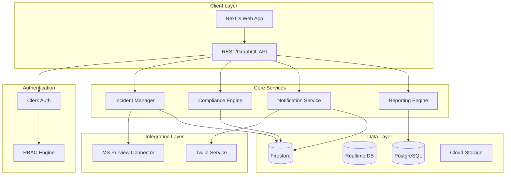
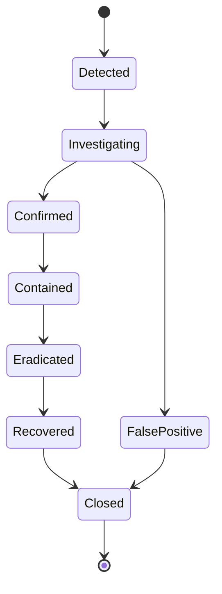
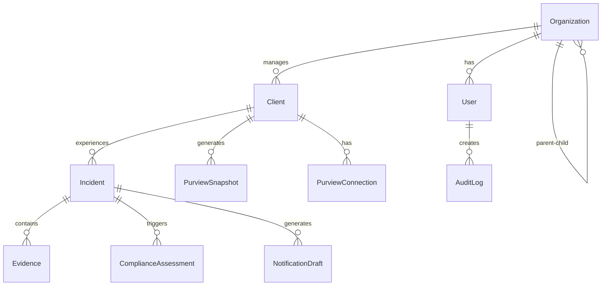

# Master Product Requirements Document
## Breach Notification SaaS Platform
### Version 1.0 | December 2024

---

## Table of Contents

1. [Executive Summary](#1-executive-summary)
2. [Platform Architecture](#2-platform-architecture)
3. [User Management & RBAC](#3-user-management--rbac)
4. [Microsoft Purview Integration](#4-microsoft-purview-integration)
5. [Incident Management](#5-incident-management)
6. [Compliance Engine](#6-compliance-engine)
7. [Notification System](#7-notification-system)
8. [Reporting & Analytics](#8-reporting--analytics)
9. [Data Architecture](#9-data-architecture)
10. [Security & Compliance](#10-security--compliance)
11. [API Specifications](#11-api-specifications)
12. [Deployment & Infrastructure](#12-deployment--infrastructure)
13. [MVP Roadmap](#13-mvp-roadmap)
14. [Appendices](#14-appendices)

---

## 1. Executive Summary

### 1.1 Product Vision
A multi-tenant SaaS platform enabling cybersecurity law firms to manage breach notification compliance for multiple enterprise clients using Microsoft Purview metadata snapshots, automated regulatory mapping, and incident response workflows.

### 1.2 Target Market
- **Primary**: Cybersecurity law firms managing multiple enterprise clients
- **Secondary**: Large enterprises with complex compliance needs
- **Tertiary**: Channel partners offering compliance services

### 1.3 Core Value Propositions
- **For Law Firms**: Streamline breach notification across multiple clients with automated compliance assessment
- **For Enterprises**: Ensure timely, accurate breach notifications meeting all regulatory requirements
- **For Channel Partners**: White-label compliance management platform for their clients

### 1.4 Key Features
- Multi-tenant architecture with hierarchical RBAC
- Microsoft Purview integration for automated PII discovery
- Intelligent compliance engine covering 50 US states + federal regulations
- Dry-run breach simulations for preparedness
- Automated notification generation (dry run for MVP)
- Comprehensive audit trail and reporting

### 1.5 Success Metrics
- Time to breach notification: <24 hours
- Regulatory compliance rate: 100%
- Client onboarding time: <48 hours
- System uptime: 99.9%
- User satisfaction: >4.0/5.0

---

## 2. Platform Architecture

### 2.1 Technology Stack

```yaml
Frontend:
  Framework: Next.js 15.3+ (stable production version)
  Language: TypeScript
  UI Library: Tailwind CSS
  State Management: Context API / Zustand

Backend:
  Database: 
    - Firestore (NoSQL) - Primary
    - Firebase Realtime DB - Live updates
    - PostgreSQL (via Firebase Connect) - Reporting
  
  Authentication: Clerk (Multi-tenant RBAC)
  
  Hosting: Firebase (Google Cloud Platform)
  
  APIs:
    - RESTful API (primary)
    - GraphQL (complex queries)
    - WebSockets (real-time updates)

Integrations:
  - Microsoft Purview (REST API)
  - Twilio (Notifications - opt-in required)
  - Google Analytics (Analytics)
  - Grafana (Monitoring)

DevOps:
  CI/CD: GitHub Actions
  Monitoring: Grafana + Google Cloud Monitoring
  Error Tracking: Sentry
  Logging: Google Cloud Logging
```

### 2.2 Architecture Principles

1. **Multi-tenancy**: Strict data isolation between organizations
2. **Scalability**: Horizontal scaling for all components
3. **Security-first**: Zero-trust architecture, encryption at rest and in transit
4. **API-first**: All features accessible via API
5. **Event-driven**: Asynchronous processing for long-running tasks

### 2.3 System Architecture Diagram



---

## 3. User Management & RBAC

### 3.1 User Hierarchy

```yaml
Platform Level:
  Super Admin:
    - Full platform access
    - Manage all tenants
    - System configuration
    - Emergency access override
  
  Platform Admin:
    - Platform operations
    - Support management
    - Monitoring access

Organization Level:
  Law Firm:
    Admin:
      - Manage law firm users
      - Onboard clients
      - Configure Purview
      - Billing management
    
    Manager:
      - Manage assigned clients
      - Create incidents
      - Generate notifications
      - Access reports
    
    Analyst:
      - View client data
      - Create drafts
      - Upload evidence
      - Read-only reports
  
  Channel Partner:
    Admin:
      - Manage partner organization
      - Onboard clients
      - White-label configuration
      - Partner billing
    
    Manager:
      - Manage partner clients
      - View compliance status
      - Generate reports
  
  Enterprise Client:
    Admin:
      - Manage enterprise users
      - Configure Purview
      - Approve incidents
      - Full data access
    
    Manager:
      - View dashboards
      - Initiate incidents
      - Review notifications
    
    Viewer:
      - View compliance status
      - Access reports
      - Read-only access

Special Roles:
  Individual Auditor:
    - Time-limited access
    - Client-specific permissions
    - Read-only audit trail
    - Report generation
```

### 3.2 Parent-Subsidiary Rules

```yaml
Parent Company:
  Permissions:
    - View aggregated data across subsidiaries
    - Set compliance policies
    - Cannot modify subsidiary data without permission
    - Separate billing per subsidiary
  
  Data Access:
    - Roll-up reporting
    - Consolidated dashboards
    - Audit trail visibility

Subsidiary:
  Permissions:
    - Independent data management
    - Can escalate to parent
    - Optional policy inheritance
    - Separate Purview connections
  
  Restrictions:
    - Cannot access sibling subsidiary data
    - Must follow parent policies if inherited
```

### 3.3 Permission Matrix

| Feature | Super Admin | Law Firm Admin | Law Firm Manager | Enterprise Admin | Enterprise Manager | Viewer |
|---------|------------|----------------|------------------|------------------|-------------------|---------|
| System Config | ✓ | - | - | - | - | - |
| User Management | ✓ | ✓ (Own Org) | - | ✓ (Own Org) | - | - |
| Client Onboarding | ✓ | ✓ | - | - | - | - |
| Purview Config | ✓ | ✓ | - | ✓ | - | - |
| Create Incident | ✓ | ✓ | ✓ | ✓ | ✓ | - |
| View Incidents | ✓ | ✓ | ✓ | ✓ | ✓ | ✓ |
| Generate Notifications | ✓ | ✓ | ✓ | ✓ | - | - |
| View Reports | ✓ | ✓ | ✓ | ✓ | ✓ | ✓ |
| Audit Trail | ✓ | ✓ | - | ✓ | - | - |

### 3.4 Authentication Implementation

```typescript
// Clerk configuration for multi-tenant RBAC
interface ClerkConfig {
  multiTenancy: {
    enabled: true,
    organizationRequired: true,
    maxOrganizationsPerUser: 10
  },
  
  roles: {
    platformRoles: ['super_admin', 'platform_admin'],
    organizationRoles: ['admin', 'manager', 'analyst', 'viewer'],
    customRoles: ['auditor', 'channel_partner']
  },
  
  security: {
    mfa: {
      required: ['admin', 'super_admin'],
      optional: ['manager', 'analyst']
    },
    sessionTimeout: 30, // minutes
    ipWhitelisting: true,
    breakGlass: {
      enabled: true,
      requiresApproval: true,
      auditLog: true
    }
  }
}
```

---

## 4. Microsoft Purview Integration

### 4.1 Integration Architecture

```yaml
Connection Management:
  - OAuth 2.0 with Azure AD
  - Service Principal per client
  - Multi-tenant Azure support
  - Automatic token refresh
  - Connection health monitoring

Data Collection:
  - 19 PII element categories
  - Custom classifier support
  - Sensitivity label mapping
  - Lineage tracking
  - Access pattern analysis

Snapshot Strategy:
  Types:
    - Full: Weekly/Monthly complete scan
    - Delta: Daily incremental changes
    - On-demand: Manual trigger for incidents
  
  Storage:
    - Compressed JSON in Cloud Storage
    - Metadata in Firestore
    - 90-day retention (configurable)
```

### 4.2 PII Elements Mapping

```yaml
Core Identifiers:
  - Full legal name → Purview: "Person's Name"
  - Alias/Preferred name → Custom classifier
  - Maiden name → Custom classifier

Government IDs:
  - SSN → Purview: "U.S. Social Security Number"
  - Driver's License → Purview: "U.S. Driver's License"
  - TIN/EIN → Purview: "U.S. Taxpayer Identification"
  - Passport → Custom: "PASSPORT_NUMBER"

Financial Data:
  - Bank Account → Purview: "U.S. Bank Account Number"
  - Credit Card → Purview: "Credit Card Number"
  - Routing Number → Custom: "ROUTING_NUMBER"

Health Information:
  - Medical Record → Custom: "MEDICAL_RECORD_NUMBER"
  - Diagnoses → Custom: "HEALTH_DIAGNOSIS"
  - Insurance ID → Custom: "HEALTH_INSURANCE_ID"

Biometric Data:
  - Fingerprint → Custom: "BIOMETRIC_DATA"
  - Face Recognition → Custom: "BIOMETRIC_DATA"
  - Palm Geometry → Custom: "BIOMETRIC_DATA"

Digital Identifiers:
  - IP Address → Purview: "IP Address"
  - MAC Address → Custom: "DEVICE_IDENTIFIER"
  - IMEI → Custom: "DEVICE_IDENTIFIER"

Credentials:
  - Username → Purview: "User Login"
  - Password → Purview: "Password"
  - PIN → Custom: "PERSONAL_PIN"

Location Data:
  - GPS Coordinates → Custom: "GEOLOCATION_DATA"
  - Physical Address → Purview: "Address"
  - VIN → Custom: "VEHICLE_IDENTIFIER"

Demographics:
  - Date of Birth → Purview: "Date of Birth"
  - Gender/Sex → Custom: "DEMOGRAPHIC_DATA"
  - Age → Derived from DOB

Additional Categories:
  - Political Affiliation → Custom: "POLITICAL_AFFILIATION"
  - Union Membership → Custom: "UNION_MEMBERSHIP"
  - Education Records → Custom: "EDUCATION_RECORDS"
  - Email Address → Purview: "Email Address"
  - Phone Number → Purview: "U.S. Phone Number"
```

### 4.3 API Integration

```typescript
class PurviewClient {
  private baseUrl = 'https://{accountName}.purview.azure.com';
  private rateLimits = {
    catalog: 4, // requests per second
    scan: 2     // requests per second
  };

  async getAssets(filter: AssetFilter): Promise<Asset[]> {
    return this.callAPI('/catalog/api/assets', {
      method: 'GET',
      params: filter
    });
  }

  async getClassifications(): Promise<Classification[]> {
    return this.callAPI('/catalog/api/classifications');
  }

  async triggerScan(dataSource: string): Promise<ScanResult> {
    return this.callAPI(`/scan/datasources/${dataSource}/scans/default/run`, {
      method: 'POST'
    });
  }

  async getLineage(assetId: string): Promise<Lineage> {
    return this.callAPI(`/catalog/api/lineage/${assetId}`);
  }
}
```

---

## 5. Incident Management

### 5.1 Incident Lifecycle



### 5.2 Incident Model

```typescript
interface Incident {
  id: string;
  clientId: string;
  status: IncidentStatus;
  severity: 'critical' | 'high' | 'medium' | 'low';
  
  timeline: {
    detected: Date;
    investigated?: Date;
    confirmed?: Date;
    contained?: Date;
    eradicated?: Date;
    recovered?: Date;
    closed?: Date;
  };
  
  scope: {
    affectedAssets: string[];
    dataTypes: PIIElement[];
    timeWindow: {
      start: Date;
      end: Date;
    };
    affectedIndividuals: {
      total: number;
      byState: Record<string, number>;
    };
  };
  
  evidence: Evidence[];
  assessments: ComplianceAssessment[];
  notifications: NotificationRecord[];
  
  metadata: {
    createdBy: string;
    assignedTo: string[];
    tags: string[];
    customFields: Record<string, any>;
  };
}
```

### 5.3 Evidence Management

```yaml
Evidence Types:
  - System logs
  - Screenshots
  - Forensic reports
  - Network captures
  - Email communications
  - Purview snapshots

Chain of Custody:
  - SHA-256 hash on upload
  - Immutable storage
  - Access logging
  - Timestamp verification
  - Digital signatures

Storage:
  - Cloud Storage for files
  - Firestore for metadata
  - Encryption at rest
  - Retention per policy
```

### 5.4 Impact Assessment

```typescript
class ImpactAssessment {
  async calculate(incident: Incident): Promise<Impact> {
    const impact = {
      dataTypes: await this.identifyDataTypes(incident),
      individuals: await this.countAffectedIndividuals(incident),
      jurisdictions: await this.determineJurisdictions(incident),
      businessImpact: await this.assessBusinessImpact(incident),
      regulatoryImpact: await this.assessRegulatoryImpact(incident)
    };
    
    return impact;
  }
  
  private async identifyDataTypes(incident: Incident): Promise<PIIElement[]> {
    // Cross-reference with Purview classifications
    // Map to regulatory data types
    // Return unique list of affected PII elements
  }
  
  private async determineJurisdictions(incident: Incident): Promise<string[]> {
    // Based on affected individuals' locations
    // Include states with data breach laws
    // Add federal if thresholds met
  }
}
```

---

## 6. Compliance Engine

### 6.1 Regulatory Coverage

```yaml
Federal Regulations:
  HIPAA:
    - Covered entities and business associates
    - 60-day notification requirement
    - 500+ individual threshold for media
  
  GLBA:
    - Financial institutions
    - Customer notification requirements
    - Regulatory reporting
  
  FERPA:
    - Educational records
    - Parent/student notification
  
  Other:
    - FTC Act
    - FCRA
    - COPPA
    - CAN-SPAM

State Regulations:
  Coverage: All 50 states + DC + US territories
  
  Key Variations:
    - Notification timelines (24 hours to 90 days)
    - Threshold requirements (1 to 1000+ individuals)
    - Safe harbors (encryption, risk assessment)
    - Attorney General notification
    - Consumer credit monitoring
    - Media notification thresholds
```

### 6.2 Compliance Assessment Engine

```typescript
class ComplianceEngine {
  async assessIncident(incident: Incident): Promise<ComplianceAssessment> {
    const assessment = {
      applicableRegulations: [],
      notificationRequired: false,
      deadlines: [],
      exemptions: [],
      requirements: []
    };
    
    // 1. Identify jurisdictions
    const jurisdictions = await this.identifyJurisdictions(incident);
    
    // 2. Load applicable regulations
    for (const jurisdiction of jurisdictions) {
      const regulations = await this.loadRegulations(jurisdiction);
      
      for (const regulation of regulations) {
        // 3. Check if breach definition met
        if (await this.meetsBreachDefinition(incident, regulation)) {
          // 4. Check thresholds
          if (await this.exceedsThreshold(incident, regulation)) {
            // 5. Check exemptions
            const exemptions = await this.checkExemptions(incident, regulation);
            
            if (!exemptions.fullyExempt) {
              assessment.applicableRegulations.push(regulation);
              assessment.notificationRequired = true;
              
              // 6. Calculate deadlines
              const deadline = await this.calculateDeadline(incident, regulation);
              assessment.deadlines.push(deadline);
              
              // 7. Determine requirements
              const requirements = await this.determineRequirements(incident, regulation);
              assessment.requirements.push(...requirements);
            }
          }
        }
      }
    }
    
    return assessment;
  }
}
```

### 6.3 Exemption Evaluation

```yaml
Encryption Safe Harbor:
  Conditions:
    - Data was encrypted
    - Encryption key not compromised
    - Industry-standard encryption used
  
  States: Most states provide this exemption

Risk Assessment:
  Conditions:
    - Low risk of harm determination
    - Documented assessment process
    - Some states require third-party assessment
  
  States: Limited states (e.g., Florida)

Good Faith Acquisition:
  Conditions:
    - Employee accessed in good faith
    - Within scope of employment
    - No further disclosure
  
  States: Most states include this

Law Enforcement Delay:
  Conditions:
    - Written request from law enforcement
    - Would impede investigation
    - Time-limited delay
  
  States: Most states allow this
```

### 6.4 Notification Timeline Calculator

```typescript
class TimelineCalculator {
  calculateDeadlines(incident: Incident, requirements: Requirement[]): Timeline {
    const timeline = new Timeline();
    
    for (const req of requirements) {
      let deadline: Date;
      
      // Base date calculation
      const baseDate = req.triggersFrom === 'discovery' 
        ? incident.timeline.detected 
        : incident.timeline.confirmed;
      
      // Calculate deadline based on type
      if (req.timeline === 'without unreasonable delay') {
        deadline = this.addDays(baseDate, 30); // Default interpretation
      } else if (req.timeline === 'immediately') {
        deadline = this.addDays(baseDate, 3); // Practical interpretation
      } else if (req.timelineDays) {
        deadline = req.businessDays 
          ? this.addBusinessDays(baseDate, req.timelineDays)
          : this.addDays(baseDate, req.timelineDays);
      }
      
      // Adjust for weekends/holidays
      deadline = this.adjustForHolidays(deadline, req.jurisdiction);
      
      timeline.add({
        jurisdiction: req.jurisdiction,
        type: req.notificationType,
        deadline: deadline,
        priority: this.calculatePriority(deadline)
      });
    }
    
    return timeline;
  }
}
```

---

## 7. Notification System

### 7.1 Notification Types

```yaml
Authority Notifications:
  Federal:
    - HHS (HIPAA breaches)
    - FTC
    - Department of Education (FERPA)
    - Financial regulators (GLBA)
  
  State:
    - Attorney General (most states)
    - State departments (health, insurance, etc.)
    - Consumer protection agencies

Individual Notifications:
  Methods:
    - Written letter (default)
    - Email (if valid consent)
    - Substitute notice (large breaches)
    - Telephone (some states)
  
  Content Requirements:
    - Nature of breach
    - Types of information involved
    - Steps taken
    - Steps individuals should take
    - Contact information

Media Notifications:
  Triggers: Usually 500+ state residents
  Outlets: Major media in affected areas
  Timing: Same as individual notice

Credit Bureaus:
  Triggers: Usually 1000+ affected
  Agencies: Equifax, Experian, TransUnion
  Information: Basic breach details
```

### 7.2 Template System (Dry Run for MVP)

```typescript
interface NotificationTemplate {
  id: string;
  type: 'authority' | 'individual' | 'media' | 'credit_bureau';
  jurisdiction: string;
  
  content: {
    subject: string;
    body: string; // With {{placeholders}}
    attachments?: AttachmentTemplate[];
  };
  
  variables: {
    company_name: string;
    incident_date: Date;
    discovery_date: Date;
    affected_count: number;
    data_types: string[];
    contact_info: ContactInfo;
    // ... other variables
  };
  
  compliance: {
    regulation: string;
    lastReviewed: Date;
    approvedBy: string;
  };
}

// MVP: Generate but don't send
class DryRunNotificationService {
  async generateNotification(
    incident: Incident, 
    template: NotificationTemplate
  ): Promise<DraftNotification> {
    // Variable replacement
    const content = await this.populateTemplate(template, incident);
    
    // Compliance validation
    const validation = await this.validateCompliance(content, template.jurisdiction);
    
    // Return draft (not sent in MVP)
    return {
      content,
      validation,
      recipients: await this.identifyRecipients(incident),
      scheduledSend: null, // Dry run - no actual sending
      status: 'draft'
    };
  }
}
```

### 7.3 Delivery Management (Post-MVP)

```yaml
Email Delivery:
  Provider: SendGrid/AWS SES
  Features:
    - Delivery tracking
    - Open/click tracking
    - Bounce handling
    - Unsubscribe management

Physical Mail:
  Provider: Lob API
  Features:
    - Address verification
    - Certified mail option
    - Return receipt
    - Tracking

Portal:
  Features:
    - Secure access codes
    - Document downloads
    - FAQ section
    - Multi-language support

Tracking:
  - Delivery confirmation
  - Engagement metrics
  - Failed delivery handling
  - Audit trail
```

---

## 8. Reporting & Analytics

### 8.1 Dashboard Types

```yaml
Executive Dashboard:
  Metrics:
    - Active incidents
    - Compliance score
    - Upcoming deadlines
    - YTD statistics
  
  Visualizations:
    - Incident trend chart
    - Geographic heat map
    - Compliance status matrix
    - Risk indicators

Operational Dashboard:
  Metrics:
    - Incident pipeline
    - Task assignments
    - SLA compliance
    - System health
  
  Features:
    - Real-time updates
    - Drill-down capability
    - Custom filters
    - Export functionality

Client Dashboard:
  Metrics:
    - Compliance status
    - Incident history
    - Upcoming requirements
    - Risk profile
  
  Customization:
    - Branded interface
    - Custom metrics
    - Scheduled reports
```

### 8.2 Report Templates

```typescript
interface ReportTemplate {
  compliance_summary: {
    period: DateRange;
    incidents: IncidentSummary[];
    compliance_rate: number;
    jurisdictions: JurisdictionCompliance[];
  };
  
  incident_report: {
    incident: Incident;
    timeline: TimelineEvent[];
    impact: ImpactAssessment;
    compliance: ComplianceAssessment;
    actions: ActionItem[];
  };
  
  audit_report: {
    period: DateRange;
    users: UserActivity[];
    data_access: DataAccessLog[];
    configuration_changes: ConfigChange[];
  };
  
  executive_briefing: {
    kpi_summary: KPIMetrics;
    risk_assessment: RiskProfile;
    recommendations: Recommendation[];
    benchmark: IndustryComparison;
  };
}
```

### 8.3 Analytics Engine

```yaml
Metrics Collection:
  - Real-time incident metrics
  - User activity tracking
  - System performance metrics
  - Compliance scoring

Analysis Types:
  - Trend analysis
  - Predictive analytics
  - Anomaly detection
  - Benchmark comparison

Data Pipeline:
  - Firestore → BigQuery (daily)
  - Real-time aggregation
  - Historical data retention
  - Privacy-preserving analytics
```

---

## 9. Data Architecture

### 9.1 Database Design

```typescript
// Firestore Collections

interface Organization {
  id: string;
  name: string;
  type: 'law_firm' | 'enterprise' | 'channel_partner';
  parentOrgId?: string; // For subsidiaries
  settings: OrganizationSettings;
  subscription: SubscriptionInfo;
  metadata: Metadata;
}

interface User {
  id: string;
  email: string;
  profile: UserProfile;
  organizations: OrganizationMembership[];
  permissions: Permission[];
  preferences: UserPreferences;
  metadata: Metadata;
}

interface Client {
  id: string;
  organizationId: string; // Law firm managing this client
  name: string;
  industry: string;
  size: 'small' | 'medium' | 'large' | 'enterprise';
  complianceProfile: ComplianceProfile;
  purviewConnections: PurviewConnection[];
  contacts: Contact[];
  metadata: Metadata;
}

interface Incident {
  id: string;
  clientId: string;
  // ... (as defined in Section 5)
}

interface PurviewSnapshot {
  id: string;
  clientId: string;
  connectionId: string;
  timestamp: Date;
  type: 'full' | 'delta';
  assets: Asset[];
  classifications: Classification[];
  metadata: SnapshotMetadata;
}

interface NotificationDraft {
  id: string;
  incidentId: string;
  type: NotificationType;
  templateId: string;
  content: NotificationContent;
  recipients: Recipient[];
  status: 'draft' | 'approved' | 'scheduled' | 'sent';
  metadata: Metadata;
}

interface AuditLog {
  id: string;
  timestamp: Date;
  userId: string;
  action: string;
  resource: string;
  details: any;
  ipAddress: string;
  userAgent: string;
}
```

### 9.2 Data Relationships



### 9.3 Data Retention

```yaml
Retention Policies:
  Incidents:
    Active: Indefinite
    Closed: 7 years
  
  Snapshots:
    Full: 1 year
    Delta: 90 days
  
  Audit Logs:
    All: 7 years (compliance requirement)
  
  Notifications:
    Sent: 7 years
    Drafts: 90 days
  
  User Data:
    Active: Indefinite
    Inactive: 90 days after deletion request
```

---

## 10. Security & Compliance

### 10.1 Security Architecture

```yaml
Authentication:
  Provider: Clerk
  Methods:
    - Email/Password
    - SSO (SAML 2.0)
    - OAuth (Google, Microsoft)
  MFA:
    - Required for admins
    - Optional for others
    - Methods: TOTP, SMS, Email

Authorization:
  Model: RBAC with attribute-based extensions
  Implementation: 
    - Clerk organizations
    - Custom permission engine
    - Row-level security in Firestore

Encryption:
  At Rest:
    - Firestore: Automatic (AES-256)
    - Cloud Storage: Customer-managed keys
    - Backups: Encrypted
  
  In Transit:
    - TLS 1.3 minimum
    - Certificate pinning for mobile
    - HSTS enabled

Data Protection:
  - PII masking in logs
  - Tokenization for sensitive data
  - Data minimization
  - Purpose limitation
```

### 10.2 Compliance Framework

```yaml
Certifications Target:
  - SOC 2 Type II
  - ISO 27001
  - HIPAA (business associate)

GDPR Compliance:
  - Data portability API
  - Right to deletion
  - Privacy by design
  - Data processing agreements

Audit Requirements:
  - Immutable audit logs
  - Quarterly access reviews
  - Annual security assessments
  - Penetration testing

Incident Response:
  - 24-hour SLA
  - Defined escalation
  - Customer notification
  - Post-mortem process
```

### 10.3 Security Controls

```typescript
// Security middleware example
class SecurityMiddleware {
  async authenticate(request: Request): Promise<User> {
    const token = request.headers.authorization;
    const user = await this.clerk.verifyToken(token);
    
    if (!user) throw new UnauthorizedException();
    
    // Additional checks
    await this.checkIPWhitelist(user, request.ip);
    await this.checkSessionValidity(user);
    await this.enforceRateLimit(user, request);
    
    return user;
  }
  
  async authorize(user: User, resource: string, action: string): Promise<boolean> {
    // Check organization membership
    if (!user.organizations.includes(resource.organizationId)) {
      return false;
    }
    
    // Check role permissions
    const permissions = await this.getPermissions(user.role);
    if (!permissions.includes(`${resource.type}:${action}`)) {
      return false;
    }
    
    // Check data-level permissions
    if (resource.type === 'client' && user.role === 'analyst') {
      return user.assignedClients.includes(resource.id);
    }
    
    return true;
  }
}
```

---

## 11. API Specifications

### 11.1 REST API Design

```yaml
Base URL: https://api.breachnotification.com/v1

Authentication:
  Type: Bearer token
  Header: Authorization: Bearer {token}

Common Headers:
  X-Organization-ID: {orgId}  # For multi-tenant context
  X-Request-ID: {uuid}        # For tracing

Rate Limiting:
  Default: 1000 requests/hour
  Burst: 100 requests/minute
  Headers: 
    - X-RateLimit-Limit
    - X-RateLimit-Remaining
    - X-RateLimit-Reset
```

### 11.2 Core Endpoints

```typescript
// Organizations
GET    /organizations
GET    /organizations/:id
POST   /organizations
PUT    /organizations/:id
DELETE /organizations/:id

// Users
GET    /users
GET    /users/:id
POST   /users
PUT    /users/:id
DELETE /users/:id
POST   /users/:id/invite
PUT    /users/:id/role

// Clients
GET    /clients
GET    /clients/:id
POST   /clients
PUT    /clients/:id
DELETE /clients/:id
POST   /clients/:id/onboard

// Purview Integration
GET    /clients/:id/purview/connections
POST   /clients/:id/purview/connections
PUT    /clients/:id/purview/connections/:connId
DELETE /clients/:id/purview/connections/:connId
POST   /clients/:id/purview/connections/:connId/test
POST   /clients/:id/purview/connections/:connId/snapshot

// Incidents
GET    /incidents
GET    /incidents/:id
POST   /incidents
PUT    /incidents/:id
PATCH  /incidents/:id/status
POST   /incidents/:id/evidence
GET    /incidents/:id/timeline
POST   /incidents/:id/assess

// Compliance
POST   /compliance/assess
GET    /compliance/regulations
GET    /compliance/regulations/:jurisdiction
GET    /compliance/deadlines
POST   /compliance/exemptions/evaluate

// Notifications
GET    /notifications
GET    /notifications/:id
POST   /notifications/generate
PUT    /notifications/:id
POST   /notifications/:id/approve
POST   /notifications/:id/send  # Post-MVP
GET    /notifications/:id/tracking

// Reports
GET    /reports
POST   /reports/generate
GET    /reports/:id
GET    /reports/:id/download
POST   /reports/schedule

// Audit
GET    /audit/logs
GET    /audit/logs/:id
POST   /audit/export
```

### 11.3 GraphQL Schema (Supplementary)

```graphql
type Query {
  # Multi-entity queries
  complianceOverview(clientId: ID!): ComplianceOverview
  incidentTimeline(incidentId: ID!): [TimelineEvent]
  
  # Complex filtering
  searchIncidents(filter: IncidentFilter): IncidentConnection
  searchClients(filter: ClientFilter): ClientConnection
  
  # Analytics
  analytics(type: AnalyticsType!, period: DateRange!): AnalyticsResult
}

type Mutation {
  # Batch operations
  batchUpdateIncidents(updates: [IncidentUpdate]!): BatchResult
  
  # Complex workflows
  initiateBreachWorkflow(input: BreachWorkflowInput!): Workflow
}

type Subscription {
  # Real-time updates
  incidentUpdated(clientId: ID): Incident
  complianceDeadlineApproaching: Deadline
  purviewSyncCompleted(clientId: ID): PurviewSnapshot
}
```

### 11.4 Webhook Events

```yaml
Outbound Webhooks:
  incident.created:
    - Incident details
    - Initial assessment
  
  incident.status_changed:
    - Previous status
    - New status
    - Changed by
  
  compliance.deadline_approaching:
    - Deadline details
    - Time remaining
    - Required actions
  
  snapshot.completed:
    - Snapshot summary
    - Changes detected
    - New classifications

Webhook Security:
  - HMAC-SHA256 signatures
  - Timestamp validation
  - Retry with exponential backoff
  - Dead letter queue for failures
```

---

## 12. Deployment & Infrastructure

### 12.1 Infrastructure Architecture

```yaml
Google Cloud Platform:
  Compute:
    - Cloud Run: Containerized services
    - Cloud Functions: Event processors
    - Cloud Scheduler: Cron jobs
  
  Storage:
    - Firestore: Primary database
    - Cloud Storage: File storage
    - Memorystore: Redis cache
  
  Networking:
    - Cloud Load Balancing
    - Cloud CDN
    - Cloud Armor (WAF)
  
  Security:
    - Identity & Access Management
    - Cloud KMS: Encryption keys
    - VPC Service Controls
  
  Operations:
    - Cloud Monitoring
    - Cloud Logging
    - Cloud Trace
    - Error Reporting
```

### 12.2 Deployment Pipeline

```yaml
Environments:
  Development:
    - Feature branches
    - Automatic deployment
    - Synthetic data
  
  Staging:
    - Main branch
    - Automatic deployment
    - Production-like data
    - Integration testing
  
  Production:
    - Tagged releases
    - Manual approval
    - Blue-green deployment
    - Automated rollback

CI/CD Pipeline:
  1. Code commit
  2. Automated tests
     - Unit tests (>80% coverage)
     - Integration tests
     - Security scanning
  3. Build artifacts
  4. Deploy to staging
  5. Run E2E tests
  6. Manual approval
  7. Deploy to production
  8. Smoke tests
  9. Monitor metrics
```

### 12.3 Scalability Design

```yaml
Horizontal Scaling:
  - Cloud Run autoscaling (1-100 instances)
  - Firestore automatic scaling
  - Cloud Functions concurrent execution
  
Performance Targets:
  - API response time: <300ms (p95)
  - Dashboard load: <2 seconds
  - Report generation: <10 seconds
  - Concurrent users: 100 (MVP), 1000 (v2)

Caching Strategy:
  - CDN for static assets
  - Redis for session data
  - Firestore caching for reads
  - Query result caching (5 min TTL)

Database Optimization:
  - Composite indexes for common queries
  - Denormalized data for read performance
  - Batch writes for efficiency
  - Collection group queries where appropriate
```

### 12.4 Monitoring & Observability

```yaml
Metrics:
  Business:
    - Active users
    - Incidents processed
    - Compliance assessments
    - API usage by client
  
  Technical:
    - Request latency
    - Error rates
    - Database performance
    - Cache hit rates
  
  Security:
    - Failed login attempts
    - Unusual access patterns
    - Data access anomalies

Alerts:
  Critical:
    - Service down
    - Database errors
    - Security breaches
    - Compliance deadlines missed
  
  Warning:
    - High latency
    - Increased error rate
    - Low disk space
    - Unusual activity

Dashboards:
  - Executive overview
  - Technical operations
  - Security monitoring
  - Client usage
```

---

## 13. MVP Roadmap

### 13.1 MVP Phase 0 (Weeks 1-4): Foundation

```yaml
Infrastructure:
  ✓ Next.js project setup
  ✓ Firebase configuration
  ✓ Clerk authentication
  ✓ Basic CI/CD pipeline

Core Features:
  ✓ User authentication
  ✓ Organization management
  ✓ Basic RBAC implementation
  ✓ Client CRUD operations

UI/UX:
  ✓ Design system components
  ✓ Navigation structure
  ✓ Basic dashboards
  ✓ Responsive layouts

Deliverables:
  - Working authentication system
  - Multi-tenant data isolation
  - Basic client management
  - Deployment pipeline
```

### 13.2 MVP Phase 1 (Weeks 5-12): Core Functionality

```yaml
Purview Integration:
  ✓ Azure AD authentication
  ✓ Connection management
  ✓ Manual snapshot trigger
  ✓ PII detection (19 categories)
  ✓ Snapshot comparison

Incident Management:
  ✓ Incident creation
  ✓ Status workflow
  ✓ Evidence upload
  ✓ Basic timeline

Compliance Engine:
  ✓ Regulatory database (50 states)
  ✓ Basic assessment logic
  ✓ Deadline calculation
  ✓ Exemption evaluation

Notifications (Dry Run):
  ✓ Template management
  ✓ Draft generation
  ✓ Variable replacement
  ✓ Compliance validation

Reporting:
  ✓ Compliance dashboard
  ✓ Incident reports
  ✓ Basic analytics
  ✓ Export functionality

Deliverables:
  - Functional Purview integration
  - Complete incident workflow
  - Compliance assessment (dry run)
  - Notification drafts
  - Basic reporting suite
```

### 13.3 MVP Success Criteria

```yaml
Functional Requirements:
  ✓ 5 pilot law firms onboarded
  ✓ 10 enterprise clients connected
  ✓ All 19 PII categories detected
  ✓ 50-state compliance coverage
  ✓ < 5 minute snapshot processing

Technical Requirements:
  ✓ 99.9% uptime
  ✓ < 300ms API response time
  ✓ Zero data isolation incidents
  ✓ Complete audit trail
  ✓ Successful security audit

Business Metrics:
  ✓ < 2 hour client onboarding
  ✓ < 30 min incident assessment
  ✓ 100% compliance accuracy
  ✓ User satisfaction > 4.0/5
```

### 13.4 Post-MVP Roadmap

```yaml
Phase 2 (Months 4-6):
  - Automated notifications (actual sending)
  - Advanced analytics & ML
  - Mobile application
  - API marketplace
  - Billing system integration

Phase 3 (Months 7-9):
  - International compliance
  - Advanced integrations (SIEM, GRC)
  - Workflow automation
  - Custom reporting builder
  - White-label enhancements

Phase 4 (Months 10-12):
  - AI-powered insights
  - Predictive compliance
  - Industry benchmarking
  - Advanced threat intelligence
  - Enterprise features
```

---

## 14. Appendices

### 14.1 Glossary

```yaml
Terms:
  PII: Personally Identifiable Information
  PHI: Protected Health Information
  RBAC: Role-Based Access Control
  MVP: Minimum Viable Product
  SLA: Service Level Agreement
  API: Application Programming Interface
  SIEM: Security Information and Event Management
  GRC: Governance, Risk, and Compliance
  KMS: Key Management Service
  CDN: Content Delivery Network
  WAF: Web Application Firewall
  GDPR: General Data Protection Regulation
  HIPAA: Health Insurance Portability and Accountability Act
  GLBA: Gramm-Leach-Bliley Act
  FERPA: Family Educational Rights and Privacy Act
```

### 14.2 References

```yaml
Documentation:
  - Microsoft Purview API Reference
  - Clerk Authentication Docs
  - Firebase/Firestore Best Practices
  - Next.js 15.3 Documentation
  - Google Cloud Security Best Practices

Standards:
  - NIST Cybersecurity Framework
  - ISO 27001:2022
  - SOC 2 Trust Services Criteria
  - OWASP Top 10

Regulations:
  - State Breach Notification Laws Database
  - Federal Trade Commission Guidelines
  - HHS HIPAA Breach Notification Rule
```

### 14.3 Change Log

```yaml
Version 1.0 (December 2024):
  - Initial master PRD creation
  - Consolidated all feature PRDs
  - Added comprehensive technical details
  - Included MVP roadmap
  - Removed payment processing (Stripe) from MVP scope

Future Updates:
  - Version 1.1: Post-MVP feature additions
  - Version 1.2: International compliance
  - Version 1.3: Enterprise features
```

---

## Document Control

- **Version**: 1.0
- **Status**: APPROVED
- **Author**: Product Team
- **Last Updated**: December 2024
- **Next Review**: March 2025
- **Distribution**: Development Team, Stakeholders

This master PRD serves as the single source of truth for the Breach Notification SaaS Platform development. All implementation decisions should reference this document.

For AI agent development, this document provides comprehensive context for understanding system architecture, user requirements, and technical implementation details.